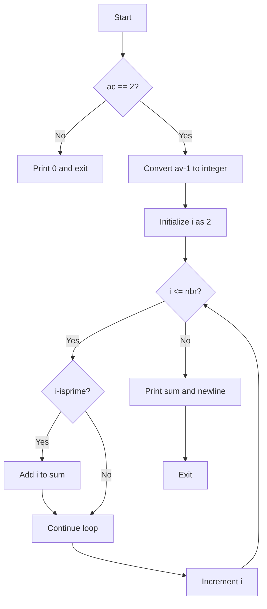

## Subject: add_prime_sum

### Problem Description

Write a program that takes a positive integer as an argument and displays the sum of all prime numbers inferior or equal to it, followed by a newline.

If the number of arguments is not 1, or the argument is not a positive number, the program should display 0 followed by a newline.

### Example

```shell
$> ./add_prime_sum 5
10
$> ./add_prime_sum 7 | cat -e
17$
$> ./add_prime_sum | cat -e
0$
```

### Approach and Explanation

1. The program first checks if the number of arguments (`ac`) is equal to 2, which means one argument is passed. If not, it directly prints 0 and exits.
2. It then converts the argument string to an integer using the `ft_atoi` function. This function converts a string to an integer.
3. The program initializes `i` as 2, which is the starting point to find prime numbers.
4. It also initializes `sum` as 0, which will be used to store the sum of prime numbers.
5. The program enters a loop that iterates from 1 to the given positive integer (`nbr`).
6. For each iteration, it checks if the number `i` is prime using the `isprime` function.
7. If `i` is prime, it adds `i` to the `sum`.
8. After the loop ends, the program prints the value of `sum` using the `ft_putnbr` function and adds a newline character.
9. The program returns 0, indicating successful execution.

### Code Explanation

The provided code implements the logic explained above. Here's a breakdown of the important functions used:

#### `void ft_putnbr(int n)`

This function takes an integer `n` and prints it to the standard output. It uses recursion to print each digit of the number.

#### `int isprime(int n)`

This function takes an integer `n` and checks if it is a prime number. It returns 1 if `n` is prime and 0 otherwise. It uses a simple loop to check for divisibility of `n` with numbers from 2 to `n/2`.

#### `int ft_atoi(char *str)`

This function takes a string `str` and converts it to an integer. It returns the converted integer value. It uses a loop to iterate over each character of the string and calculates the corresponding integer value by subtracting the ASCII value of '0'.

#### `int main(int ac, char **av)`

The `main` function is the entry point of the program. It follows the approach explained earlier and handles the argument parsing, prime number sum calculation, and output printing.

### Flowchart

Here's a flowchart representation of the program's logic:



This flowchart illustrates the decision-making process and the flow of execution in the program.

### Conclusion

The provided code correctly solves the problem by calculating the sum of prime numbers up to the given positive integer

 and printing the result. The implementation follows the expected logic and includes necessary helper functions for input conversion and output printing.
