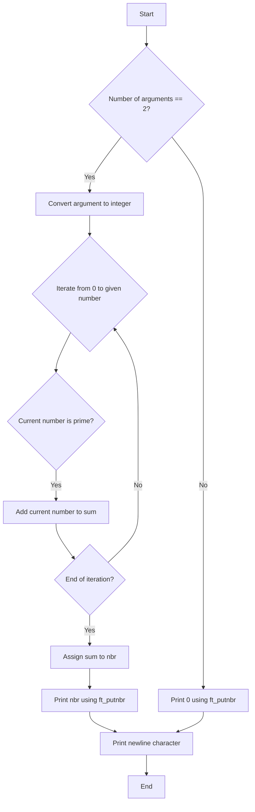

## **Assignment: add_prime_sum**

### Subject

Write a program that takes a positive integer as an argument and displays the sum of all prime numbers inferior or equal to it followed by a newline.

If the number of arguments is not 1, or the argument is not a positive number, just display 0 followed by a newline.

### Code Explanation

The code provided implements the required functionality using the following steps:

1. The `isprime` function checks if a given number `n` is prime. It returns 1 if the number is prime and 0 otherwise. It uses a simple algorithm to iterate from 2 to the square root of `n` and checks if `n` is divisible by any number in that range.

2. The `ft_putnbr` function is a recursive function that prints a given number `n` to the standard output. It converts the number into a string and writes each digit one by one using the `write` system call.

3. The `ft_atoi` function converts a string `str` into an integer. It iterates over the characters of the string and builds the integer by multiplying the previous value by 10 and adding the ASCII value of the current character minus the ASCII value of the character '0'.

4. The `main` function is the entry point of the program. It checks if the number of arguments is 2, indicating that a positive integer has been provided. If so, it converts the argument to an integer using `ft_atoi`. Then, it iterates from 0 to the given number and adds all prime numbers to the `sum` variable. Finally, it assigns the value of `sum` to `nbr` and prints it using `ft_putnbr`.

5. The program ends by writing a newline character to the standard output.

### Flowchart

### Conclusion

The provided code correctly implements the functionality to calculate the sum of prime numbers up to a given positive integer. It checks the number of arguments, converts the argument to an integer, iterates through the numbers, checks for primes, and calculates the sum. The result is then printed using `ft_putnbr`, followed by a newline character. If the number of arguments is not 2 or the argument is not a positive number, it simply prints 0.
