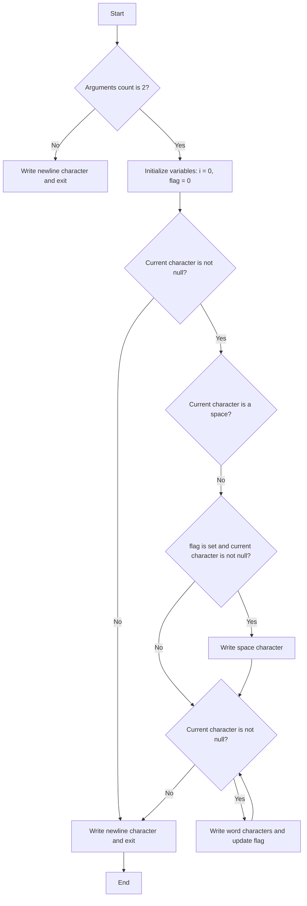

## Assignment: epur_str

### Subject

Write a program that takes a string and displays this string with exactly one space between words, with no spaces or tabs either at the beginning or the end, followed by a newline character (`\n`).

A "word" is defined as a part of a string delimited either by spaces/tabs or by the start/end of the string.

If the number of arguments is not 1 or if there are no words to display, the program should display only a newline character.

### Implementation

```c
#include <unistd.h>

int main(int ac, char **av)
{
    int i = 0, flag = 0;
    if (ac == 2)
    {
        while (av[1][i])
        {
            while (av[1][i] == ' ')
                i++;
            if (flag && av[1][i])
                write(1, " ", 1);
            while (av[1][i] && av[1][i] != ' ')
                flag = write(1, &av[1][i++], 1);
            if (av[1][i])
                i++;
        }
    }
    write(1, "\n", 1);
    return 0;
}
```

The program takes two command-line arguments: `ac` (argument count) and `av` (argument vector). It checks if the number of arguments is exactly 2 (`ac == 2`). If not, it simply writes a newline character and exits.

Inside the if condition, the program iterates over the characters of the input string (`av[1]`). It skips any leading spaces by incrementing the index `i` until a non-space character is found.

Then, it checks if `flag` is set (indicating that a word has been written), and if the current character is not a null character. If both conditions are true, it writes a space character.

Next, it iterates over the non-space characters of the current word and writes them using the `write` function. The variable `flag` is set to the return value of `write`, which indicates the number of characters written. This is used to determine if a word has been written.

After writing the word, it checks if the current character is not a null character and increments the index `i` to move to the next character.

Finally, outside the if condition, it writes a newline character and exits.

### Flowchart



The flowchart represents the control flow of the program. It starts by checking if the argument count is 2. If not, it writes a newline character and exits. If the argument count is 2, the program enters a loop to process the characters of the input string.

Inside the loop, it checks if the current character

 is a space. If not, it checks if the flag is set and the current character is not null to write a space character. Then, it writes the characters of the current word and updates the flag accordingly. After each iteration, it checks if the current character is null. If not, it continues to the next character; otherwise, it writes a newline character and exits.

This flowchart illustrates the program's logic and helps visualize the different paths the execution can take.
