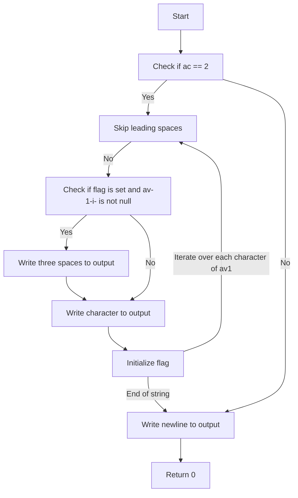

## Assignment: expand_str

### Subject

Write a program that takes a string and displays it with exactly three spaces between each word, with no spaces or tabs either at the beginning or the end, followed by a newline.

A word is a section of string delimited either by spaces/tabs, or by the start/end of the string.

If the number of parameters is not 1, or if there are no words, simply display a newline.

### My Code Explanation

The given code is a C program that aims to achieve the desired functionality. Let's go through the code and understand its implementation.

```c
#include <unistd.h>

int main(int ac, char **av)
{
    int i = 0, flag = 0;

    if (ac == 2)
    {
        while(av[1][i])
        {
            while(av[1][i] == ' ')
                i++;
            if (flag && av[1][i])
                write(1, "   ", 3);
            while(av[1][i] != ' ' && av[1][i])
            {
                flag = 1;
                write(1, &av[1][i], 1);
                i++;
            }
        }
    }
    write(1, "\n", 1);
    return (0);
}
```

The `main` function takes two parameters: `ac` (argument count) and `av` (argument vector). The program expects one command-line argument, hence it checks if `ac` is equal to 2.

Inside the if block, the program uses a while loop to iterate through each character of the input string (`av[1]`). The variable `i` is used as an index to access individual characters.

The first inner while loop skips any leading spaces in the string by incrementing `i` until a non-space character is encountered.

The next if statement (`if (flag && av[1][i])`) checks if the `flag` variable is set to 1 (indicating that a word has been encountered) and if the current character is not a null character. If both conditions are satisfied, it means that the program is currently in the middle of a word, and it writes three spaces to the standard output using the `write` function.

The second inner while loop (`while(av[1][i] != ' ' && av[1][i])`) writes each character of the current word to the standard output using the `write` function. It also sets the `flag` variable to 1, indicating that a word has been encountered.

After the loops, the program writes a newline character (`\n`) to the standard output, regardless of the input.

Finally, the `main` function returns 0, indicating successful execution of the program.

### Flowchart Diagram

Here is a flowchart diagram illustrating the control flow of the given code:



### Conclusion

The code implement the required functionality of printing the input string with exactly three spaces between each word
