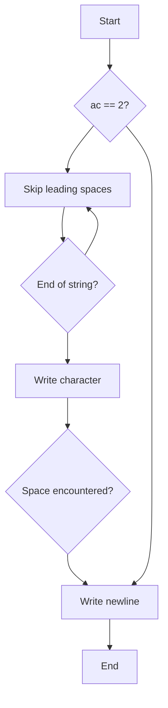

## First Word

### Subject
The task is to write a program that takes a string as input and displays its first word, followed by a newline. A word is defined as a section of the string delimited by spaces or tabs, or by the start or end of the string. If there are no words in the input string or if the number of parameters is not exactly 1, the program should simply display a newline.

### Code Explanation
```c
#include <unistd.h>

int main(int ac, char **av) {
    int i = 0;
    if (ac == 2) {
        while (av[1][i] == ' ')
            i++;
        while (av[1][i] && av[1][i] != ' ')
            i += write(1, &av[1][i], 1);
    }
    write(1, "\n", 1);
    return 0;
}
```
The code starts by including the necessary header file `unistd.h` which provides the write function. The main function takes two arguments, `ac` (argument count) and `av` (argument vector), representing the number of command-line arguments and the array of strings containing those arguments, respectively.

The program first checks if the number of parameters is exactly 2 (including the program name itself). If not, it skips the processing and directly writes a newline character.

If the number of parameters is 2, the program proceeds to find and display the first word from `av[1]` (the second command-line argument). It starts by skipping any leading spaces in the string by incrementing the index `i` until a non-space character is encountered.

Then, using a while loop, the program iterates over the string starting from the current index `i` and writes each character to the standard output using the write function. It stops writing when either a space character is encountered or the end of the string is reached. The variable `i` is incremented by the number of characters written in each iteration.

Finally, the program writes a newline character to the standard output using the write function.

### Flowchart



The flowchart represents the control flow of the program. It starts with a decision point, checking if the number of parameters is 2. If the condition is true, the program proceeds to skip any leading spaces. From there, it checks if the end of the string is reached. If not, it writes the character to the standard output and then checks if a space character is encountered. If a space is found, it writes a newline character and the program ends. If not, it continues writing characters until the end of the string is reached.
