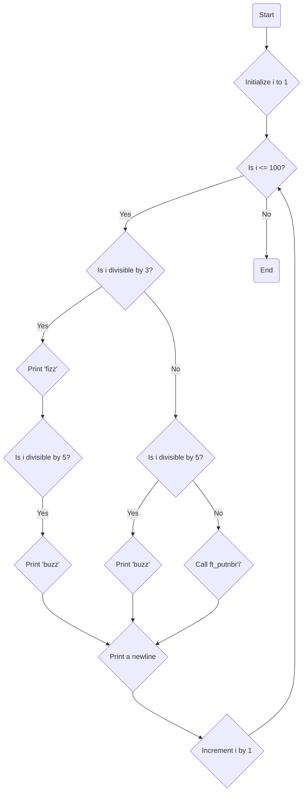

### Subject: FizzBuzz Program

### Code Explanation:

The provided code is a solution to the FizzBuzz problem. It prints the numbers from 1 to 100, with specific replacements for certain numbers based on given conditions.

The program starts by defining a function `ft_putnbr` that recursively prints a given integer by converting it to a character and using the `write` function to write the character to the standard output.

In the `main` function, a variable `i` is initialized to 1. Then, a `while` loop is used to iterate through numbers from 1 to 100.

Inside the loop, the program checks the following conditions for each number:

1. If the number `i` is divisible by 3 (i.e., `i % 3 == 0`), it writes the string "fizz" to the standard output using the `write` function.

2. If the number `i` is divisible by 5 (i.e., `i % 5 == 0`), it writes the string "buzz" to the standard output using the `write` function.

3. If the number `i` is not divisible by 3 and not divisible by 5, it calls the `ft_putnbr` function to print the number `i` to the standard output.

After executing the above conditions, a newline character (`"\n"`) is written to the standard output using the `write` function to separate each number.

Finally, the variable `i` is incremented, and the loop continues until `i` reaches 100.

The program repeats this process for each number from 1 to 100, producing the desired output where numbers divisible by 3 are replaced with "fizz", numbers divisible by 5 are replaced with "buzz", and numbers divisible by both 3 and 5 are replaced with "fizzbuzz".

### Mermaid Diagram:

The diagram represents the flow of the FizzBuzz program. It starts at the "Start" node and checks if `i` is less than or equal to 100. If true, it proceeds to check if `i` is divisible by 3. If it is, "fizz" is printed. Then, it checks if `i` is divisible by 5. If true, "buzz" is printed. In both cases, a newline character is printed. If `i` is not divisible by 3 or 5, the `ft_putnbr` function is called to print `i`. After each iteration, `i` is incremented by 1, and the process continues until `i` is no longer less than or equal to 100, at which point the program reaches the "End" node.
