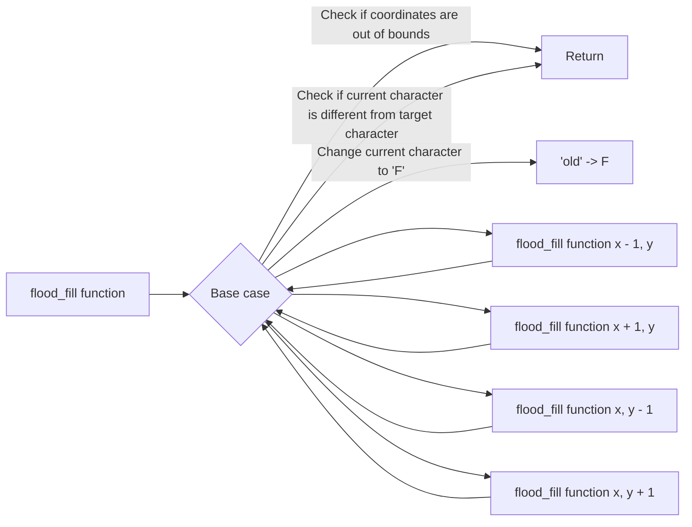

The `flood_fill` function takes a 2D array `tab`, representing a grid of characters, along with the `size` of the grid and the starting point `begin`. The function recursively fills connected regions in the grid with the character 'F', starting from the `begin` point.

The function `ft` (short for "flood fill") is a recursive helper function that performs the actual flood fill operation. It takes the current coordinates `(x, y)`, the grid `tab`, the grid `size`, and the target character `c`. It checks the base case conditions: if the coordinates are out of bounds or if the current character is different from the target character, it returns.

If the base case conditions are not met, it changes the current character to 'F' and recursively calls `ft` for the four neighboring cells: `(x - 1, y)`, `(x + 1, y)`, `(x, y - 1)`, and `(x, y + 1)`.

The `flood_fill` function simply calls `ft` with the starting coordinates `begin.x` and `begin.y` and the target character `tab[begin.y][begin.x]`. This initiates the flood fill operation from the starting point.

The provided mermaid diagram visually represents the flow of the code, illustrating the recursive calls and base case conditions.

### Flood Fill Algorithm

The **Flood Fill** algorithm is a technique used in computer graphics and image processing to fill a contiguous area of pixels with a specific color. It starts from a given pixel and recursively visits adjacent pixels of the same color, changing their color until the entire area is filled.

The algorithm is commonly used for tasks such as filling shapes, coloring regions, and implementing bucket fill tools in graphics editing software.

#### How Flood Fill Works

The Flood Fill algorithm follows a simple process:

1. Start at a given pixel in an image or grid.
2. Check the color of the current pixel.
3. If the color of the current pixel matches the target color, change its color to the replacement color.
4. Recursively apply the algorithm to the neighboring pixels (up, down, left, and right) that have the same color as the original pixel.
5. Repeat steps 2-4 for each visited pixel until all connected pixels of the same color are processed.

The algorithm effectively "floods" the area with the replacement color, spreading from the initial pixel to adjacent pixels of the same color and continuing until the entire connected region is filled.
