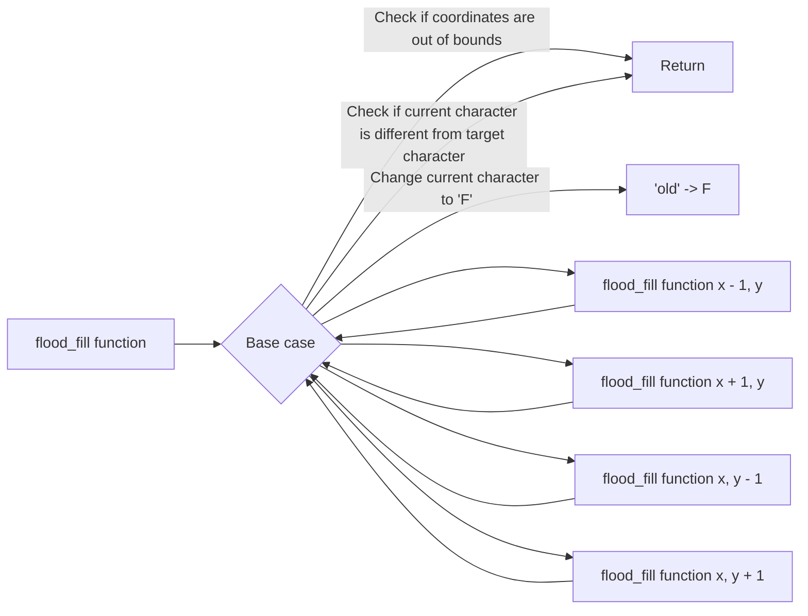

The `flood_fill` function takes a 2D array `tab`, representing a grid of characters, along with the `size` of the grid and the starting point `begin`. The function recursively fills connected regions in the grid with the character 'F', starting from the `begin` point.

The function `ft` (short for "flood fill") is a recursive helper function that performs the actual flood fill operation. It takes the current coordinates `(x, y)`, the grid `tab`, the grid `size`, and the target character `c`. It checks the base case conditions: if the coordinates are out of bounds or if the current character is different from the target character, it returns.

If the base case conditions are not met, it changes the current character to 'F' and recursively calls `ft` for the four neighboring cells: `(x - 1, y)`, `(x + 1, y)`, `(x, y - 1)`, and `(x, y + 1)`.

The `flood_fill` function simply calls `ft` with the starting coordinates `begin.x` and `begin.y` and the target character `tab[begin.y][begin.x]`. This initiates the flood fill operation from the starting point.

The provided mermaid diagram visually represents the flow of the code, illustrating the recursive calls and base case conditions.

