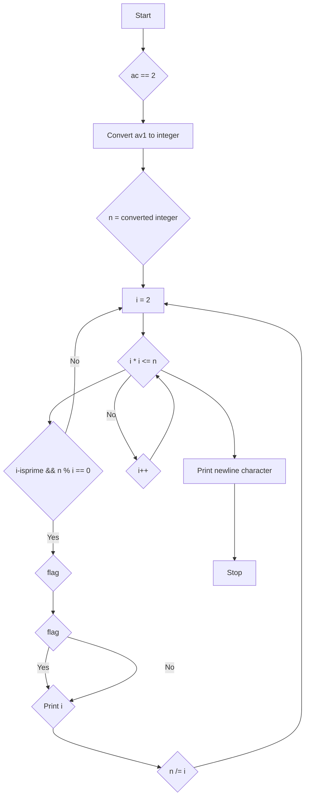

## Subject: fprime

### Problem Description

Write a program that takes a positive integer as input and displays its prime factors on the standard output, separated by '*' and in ascending order. The program should output a newline character after the factors.

### Input

The program takes a single positive integer as a command-line argument.

### Output

The program outputs the prime factors of the input number in ascending order, separated by '*', followed by a newline character.

### Constraints

- The input number is a positive integer.

### Examples

#### Example 1

Input:
```
./fprime 225225
```

Output:
```
3*3*5*5*7*11*13
```

#### Example 2

Input:
```
./fprime 42
```

Output:
```
2*3*7
```

#### Example 3

Input:
```
./fprime 1
```

Output:
```
1
```

#### Example 4

Input:
```
./fprime
```

Output:
```
(empty output)
```

### Approach and Explanation

The given program takes a positive integer as input and finds its prime factors. It then prints the factors separated by '*', in ascending order.

The main steps of the program are as follows:

1. Read the command-line argument as an integer.
2. Initialize a counter `i` to 2 and a flag `flag` to 0.
3. Iterate until the input number is greater than 1.
   - Check if `i` is a prime number and if it is a factor of the input number.
     - If both conditions are true, print `i` (if it's not the first factor, print '*' before it) and update the flag.
     - Divide the input number by `i`.
   - Increment `i` by 1.
4. Print a newline character.

The `isprime` function is used to check whether a number is prime or not. It returns 1 if the number is prime and 0 otherwise.

### Flowchart



### Complexity Analysis

The time complexity of the program depends on the input number `n`. Let `m` be the largest prime factor of `n`. The time complexity can be approximated as O(m) since the loop iterates until `i` reaches `m`. In the worst case, the program needs to check the primality of all numbers from 2 to `m`, which requires O(m) operations.

The space complexity of the program is O(1) as it uses a constant amount of additional space.
