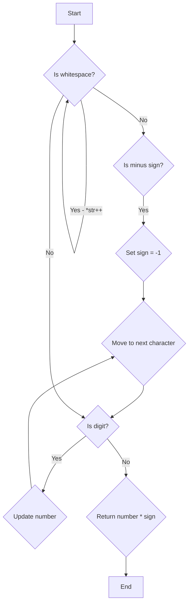

# ft_atoi

The `ft_atoi` function is designed to convert a string representation of an integer to an actual integer value. It works similarly to the standard library function `atoi(const char *str)`.

## Implementation

Here is the implementation of the `ft_atoi` function:

```c
int ft_atoi(const char *str)
{
    int nbr = 0;
    int sgn = 1;

    // Skip leading whitespace characters
    while (*str == 32 || (*str >= 9 && *str <= 13))
        str++;

    // Handle the sign
    sgn -= 2 * (*str == '-');
    if (*str == '-' || *str == '+')
        str++;

    // Convert digits to integer value
    while (*str >= '0' && *str <= '9')
    {
        nbr = nbr * 10 + (*str - '0');
        str++;
    }

    return nbr * sgn;
}
```

Let's go through the code and understand how it works.

1. The function takes a pointer to a constant character (`const char *str`) as input and returns an integer (`int`).

2. The `nbr` variable is used to store the final integer value that will be returned.

3. The `sgn` variable represents the sign of the integer (1 for positive, -1 for negative). It is initialized to 1 initially.

4. The first while loop is used to skip any leading whitespace characters (ASCII code 32 for space and ASCII codes 9-13 for control characters).

5. The `sgn` variable is updated based on whether the first non-whitespace character is a minus sign ('-') or a plus sign ('+'). If it is a minus sign, `sgn` is set to -1, otherwise it remains 1. The character is then skipped.

6. The second while loop iterates through the remaining characters and converts them to an integer value. It multiplies the existing `nbr` value by 10 and adds the current digit value (`*str - '0'`) to it. The character is then advanced to the next one.

7. Finally, the function returns the computed integer value multiplied by the sign (`nbr * sgn`).

## Example

Let's consider an example to understand how the `ft_atoi` function works:

```c
#include <stdio.h>

int main()
{
    const char *str = "   -12345";

    int result = ft_atoi(str);
    printf("Result: %d\n", result);

    return 0;
}
```

In this example, the input string is `"   -12345"`. The string contains leading whitespace characters, which are skipped by the first while loop. The first non-whitespace character encountered is a minus sign ('-'), so the sign is set to -1. The remaining characters `'1'`, `'2'`, `'3'`, `'4'`, and `'5'` are converted to the integer value `12345` by the second while loop. The final result is `-12345`, which is printed to the console.

## Flowchart

Here is a flowchart representation of the `ft_atoi` function:



The flowchart visualizes the logic of the function, depicting the decision points and actions taken for each case.
