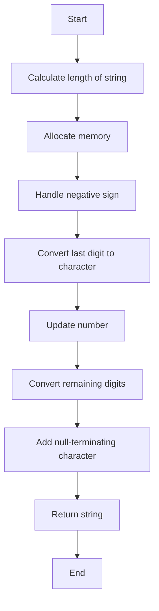

# Assignment: ft_itoa

## Subject
Write a function `ft_itoa` that takes an `int` and converts it to a null-terminated string. The function should return the result in a dynamically allocated character array.

### Prototype
```c
char	*ft_itoa(int nbr);
```

### Allowed Functions
- `malloc`

## Solution

### Approach
To convert an integer to a string, we need to follow these steps:
1. Determine the length of the resulting string by counting the digits in the integer.
2. Allocate memory for the string.
3. Handle the sign of the integer if it is negative.
4. Convert each digit of the integer to a character and store it in the string.
5. Add the null-terminating character at the end of the string.
6. Return the resulting string.

### Code Explanation
Here is the breakdown of the `ft_itoa` function:

```c
int nbrlen(int n)
{
    int i = !n;
    while(n)
    {
        n /= 10;
        i++;
    }
    return i;
}
```

The `nbrlen` function is a helper function that calculates the length of the string representation of the given integer `n`. It counts the number of digits by repeatedly dividing the number by 10 until it becomes 0.

```c
char *ft_itoa(int nbr)
{
    int sign = nbr < 0;
    int len = nbrlen(nbr) + sign;
    char *str = (char *)malloc(sizeof(char *) * (len + 1));
    if(!str)
        return NULL;
    str[len] = '\0';
    if(sign)
    {
        *str = '-';
        str[--len] = -(nbr % 10) + '0';
        nbr = -(nbr / 10);
    }
    while(len-- - sign)
    {
        str[len] = nbr % 10 + '0';
        nbr /= 10;
    }
    return str;
}
```

The `ft_itoa` function converts the given integer `nbr` to a string representation. Here's a step-by-step explanation:

1. We first determine the sign of the number by checking if it is less than 0. This will help us handle negative numbers.
2. Next, we calculate the length of the resulting string by adding the sign to the length returned by `nbrlen`.
3. We allocate memory for the string using `malloc`, taking into account the required length plus one additional character for the null-terminating character.
4. If the allocation fails, we return `NULL`.
5. We set the null-terminating character at the end of the string.
6. If the number is negative, we add the negative sign at the beginning of the string and convert the last digit (obtained by taking the modulo 10 of the absolute value of the number) to a character.
7. We update the number to be the absolute value of the number divided by 10 (integer division).
8. Finally, we iterate over the remaining digits of the number, converting each digit to a character and storing it in the string from right to left.
9. The resulting string is returned.

## Example

```c
#include <stdio.h>
#include <stdlib.h>

int main(void)
{
    int i = -10;
    char *str;

    while(i < 15)
    {
        str = ft_itoa(i);
        printf("%-3d%4s|\n", i, str);
        free(str);
        i++;
    }
    return 0;
}
```

This example demonstrates the usage of the `ft_itoa`

 function by converting integers from -10 to 15 to their corresponding string representation and printing them. The dynamically allocated memory is freed after each iteration.

The output will be:

```
-10 -10|
-9  -9 |
-8  -8 |
-7  -7 |
-6  -6 |
-5  -5 |
-4  -4 |
-3  -3 |
-2  -2 |
-1  -1 |
0   0 |
1   1 |
2   2 |
3   3 |
4   4 |
5   5 |
6   6 |
7   7 |
8   8 |
9   9 |
10 10 |
11 11 |
12 12 |
13 13 |
14 14 |
15 15 |
```

### flowchart for the `ft_itoa` function:




This flowchart represents the step-by-step process followed by the `ft_itoa` function to convert an integer to a string. Each step is represented by a node, and the arrows indicate the flow of execution.

Please let me know if you have any further questions or need additional assistance!
