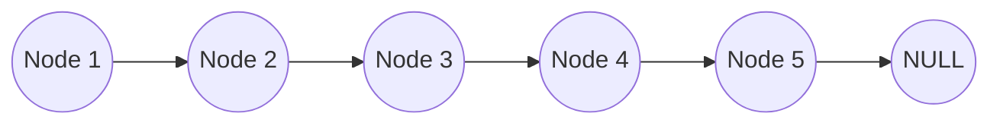

### Assignment: ft_list_size

#### Problem Statement

Write a function `ft_list_size` that calculates and returns the number of elements in a linked list.

#### Input

The input to the `ft_list_size` function is a pointer to the beginning of the linked list. The linked list is represented using the following structure:

```c
typedef struct s_list
{
    struct s_list *next;
    void *data;
} t_list;
```

The `next` member of each node points to the next node in the linked list, and the `data` member stores the data associated with the node.

#### Output

The `ft_list_size` function should return an integer value representing the number of elements in the linked list.

#### Implementation

The implementation of `ft_list_size` can be done using a simple loop that iterates through the linked list and counts the number of nodes. Here is the code:

```c
int ft_list_size(t_list *begin_list)
{
    int count = 0;
    while (begin_list)
    {
        count++;
        begin_list = begin_list->next;
    }
    return count;
}
```

The function starts with an initial count of 0. It then traverses the linked list by following the `next` pointers until it reaches the end of the list (i.e., `begin_list` becomes `NULL`). During each iteration, it increments the count by 1. Finally, it returns the count, which represents the number of elements in the linked list.

#### Explanation

The function `ft_list_size` takes a pointer to the beginning of the linked list as its argument. It initializes a variable `count` to 0, which will be used to keep track of the number of elements in the list.

The function then enters a loop that continues as long as `begin_list` is not `NULL`. In each iteration of the loop, it increments `count` by 1 and updates `begin_list` to point to the next node in the list (`begin_list->next`).

This process continues until `begin_list` becomes `NULL`, indicating that the end of the list has been reached. At this point, the loop terminates, and the final value of `count` is returned as the result.

#### Diagram

Here is a visual representation of the linked list:



The function `ft_list_size` traverses the linked list, starting from the beginning:

```
begin_list --> A --> B --> C --> D --> E --> F (NULL)
```

In each iteration, it moves to the next node until it reaches the end of the list (NULL). The count is incremented at each step:

```
count = 0
count = 1 (A)
count = 2 (B)
count = 3 (C)
count = 4 (D)
count = 5 (E)
count = 6 (F, NULL)
```

Finally, the function returns the count, which is the number of elements in the linked list.

#### Complexity Analysis

The `ft_list_size` function has a time complexity of O(n), where n is the number of nodes in the linked
