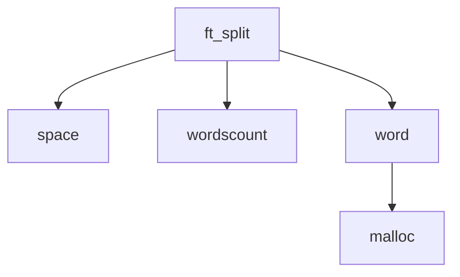

### Subject: ft_split

### Code Explanation:

The `ft_split` function takes a string `str` as input and splits it into words. It returns a NULL-terminated array of strings, where each string represents a word.

The code consists of three helper functions: `space`, `wordscount`, and `word`.

The `space` function checks if a character is a space (ASCII value 32) or a whitespace character (ASCII values 9-13). It returns 1 if the character is a space or whitespace, and 0 otherwise.

The `wordscount` function counts the number of words in the string `str`. It iterates through the characters of the string, skipping spaces and counting each non-space sequence as a word.

The `word` function extracts a word from the string `str` starting from the position `k`. It determines the length of the word by iterating until a space or the end of the string is encountered. Then, it dynamically allocates memory for the word using `malloc` and copies the characters of the word into the allocated memory. Finally, it updates the position `k` to the next word and returns the allocated word.

The `ft_split` function first allocates memory for the array of strings using `malloc`. The size of the array is determined by calling the `wordscount` function. Each word is extracted using the `word` function and stored in the array. The iteration continues until the end of the string is reached. Finally, a NULL terminator is added to the last element of the array to mark the end.

The resulting array of strings is returned.

### Code Diagram:

The diagram illustrates the relationships between the functions used in the `ft_split` implementation. The `ft_split` function calls the `space`, `wordscount`, and `word` functions to split the input string into words. The `word` function utilizes `malloc` to allocate memory for each word extracted from the string.
