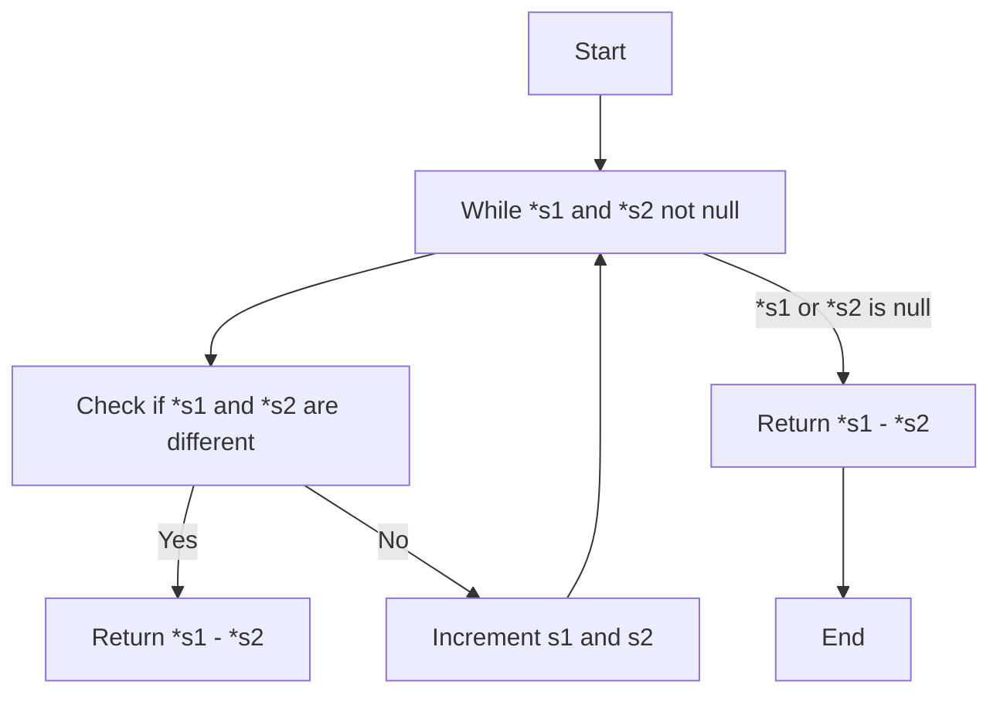

## ft_strcmp

### Subject
Reproduce the behavior of the function `strcmp` (man strcmp).

### Code Explanation

The code implements the `ft_strcmp` function, which compares two strings `s1` and `s2`. The function returns an integer value that indicates the relationship between the two strings.

The `ft_strcmp` function follows the behavior of the standard `strcmp` function. It compares each character of the strings `s1` and `s2` until it encounters a difference or reaches the end of either string. Here's how the code works:

1. The function takes two parameters, `s1` and `s2`, representing the two strings to be compared.

2. The code enters a `while` loop, which continues as long as both `*s1` and `*s2` are not null terminators (`'\0'`). This loop iterates over each character of the strings until it finds a difference or reaches the end of either string.

3. Inside the loop, an `if` condition checks if the characters pointed to by `s1` and `s2` are not equal. If they are different, the code calculates and returns the difference between the ASCII values of the characters (`*s1 - *s2`), indicating the lexical order of the strings.

4. If the characters are equal, the code increments both `s1` and `s2` pointers using the post-increment operators `*s1++` and `*s2++`, respectively. This moves the pointers to the next characters in the strings.

5. Once the loop ends, the code reaches a return statement outside the loop. At this point, one of the strings has reached its end, and the other string may have remaining characters. To determine the lexical order, the code returns the difference between the ASCII values of the current characters pointed to by `s1` and `s2` (`*s1 - *s2`).

### Code Diagram
Below is a diagram explaining the flow of the `ft_strcmp` function:

The diagram illustrates that the function starts by checking if both `*s1` and `*s2` are not null terminators. It then enters a loop where it compares the characters and increments the pointers until a difference is found or one of the strings ends. Finally, it returns the difference between the current characters or the end-of-string difference, depending on the case.
