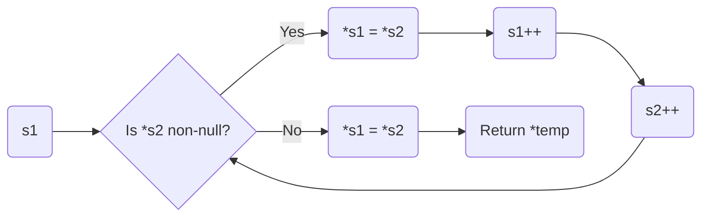

## ft_strcpy

### Subject

Reproduce the behavior of the function `strcpy` (man strcpy).

Your function must be declared as follows:

```c
char *ft_strcpy(char *s1, char *s2);
```

### My Code Explanation

```c
char *ft_strcpy(char *s1, char *s2)
{
    char *temp = s1;
    while (*s2)
    {
        *s1 = *s2;
        *s1++;
        *s2++;
    }
    *s1 = *s2;
    return (temp);
}
```

Explanation:

1. Declare a pointer `temp` and initialize it with the starting address of `s1`. This will be used to return the pointer to the destination string.
2. Use a `while` loop to iterate through the characters of `s2`.
3. Inside the loop, assign the value of the current character in `s2` to the current character in `s1` using the dereference operator `*`.
4. Increment the pointers `s1` and `s2` to point to the next characters in the strings.
5. After the loop ends, assign the null character (`\0`) to the end of `s1` to terminate the copied string.
6. Return the pointer `temp`, which points to the beginning of the copied string.

### Diagram




The diagram represents the flow of execution in the `ft_strcpy` function. It starts by checking if the current character in `s2` is non-null. If it is, the character is copied to `s1`, and the pointers `s1` and `s2` are incremented. This process continues until a null character is encountered in `s2`. Finally, the null character is assigned to `s1`, and the function returns the pointer to the copied string.
