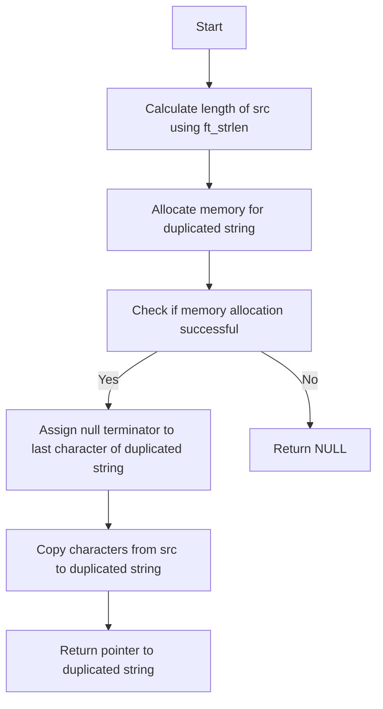

## Assignment: ft_strdup

### Code Explanation

The goal of the assignment is to reproduce the behavior of the `strdup` function. The `strdup` function is used to create a new string by duplicating an existing string.

The provided code contains two functions:

#### `ft_strlen`

The `ft_strlen` function calculates the length of a string. It takes a pointer to a character array (`str`) and iterates through the array until it reaches the null terminator (`'\0'`). It returns the length of the string.

#### `ft_strdup`

The `ft_strdup` function duplicates the input string (`src`) and returns a pointer to the newly allocated memory containing the duplicated string.

1. The `ft_strdup` function first calls `ft_strlen` to determine the length of the input string (`src`).

2. It then allocates memory for the duplicated string using the `malloc` function. The allocated memory size is `(len + 1)` to accommodate the null terminator.

3. If the `malloc` function fails to allocate memory (returns `NULL`), the function also returns `NULL`.

4. If memory allocation is successful, the function assigns the null terminator to the last character of the duplicated string.

5. It then uses a loop to copy each character from the original string to the duplicated string. The loop starts from the last character of the original string and iterates until it reaches the first character (including the null terminator). It assigns each character to the corresponding position in the duplicated string.

6. Finally, the function returns the pointer to the duplicated string.

### Flowchart

Here's a flowchart representation of the `ft_strdup` function:

The flowchart illustrates the step-by-step process of the `ft_strdup` function, including checking for memory allocation failure and handling both success and failure scenarios.

### Conclusion

The `ft_strdup` function replicates the behavior of the `strdup` function by duplicating a given string and returning a pointer to the newly allocated memory containing the duplicated string
