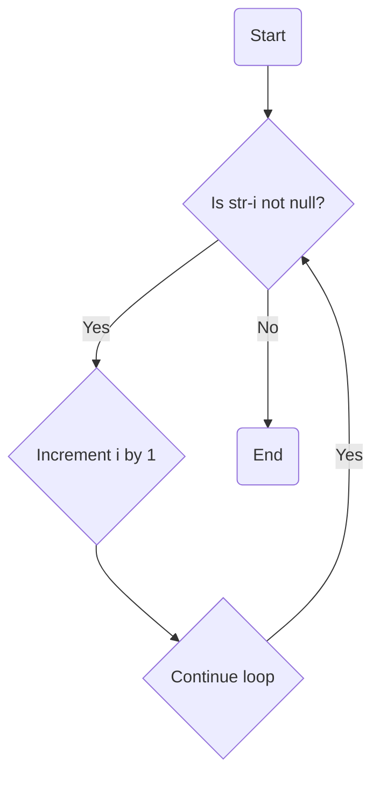

## ft_strlen

### Problem Statement

The task is to write a function `ft_strlen` that calculates the length of a given string. The function should return the length of the string as an integer.

### Function Signature

```c
int ft_strlen(char *str);
```

### Approach and Implementation

The provided code for the `ft_strlen` function is a straightforward implementation to calculate the length of a string.

The function starts by initializing a counter variable `i` to zero. Then it enters a while loop that iterates until the null terminator character (`'\0'`) is encountered. Inside the loop, it increments the counter `i` by one for each character in the string. Once the null terminator is reached, the loop terminates, and the final value of `i` represents the length of the string. Finally, the function returns the length as an integer.

Here is the code for the `ft_strlen` function:

```c
int ft_strlen(char *str)
{
    int i = 0;
    while (str[i])
        i++;
    return i;
}
```

The function takes a pointer to the string as a parameter (`char *str`) and returns an integer representing the length of the string.

### Visualization

We can visualize the code using a flowchart to better understand the logic:



The flowchart shows the iterative process of checking each character of the string (`str[i]`) until the null terminator is encountered. The counter `i` is incremented at each iteration, and the loop continues until the null terminator is reached. Once the loop ends, the final value of `i` is returned as the length of the string.

### Conclusion

The provided code for the `ft_strlen` function is a simple and effective implementation to calculate the length of a string. It iterates through each character of the string and counts the characters until the null terminator is encountered. The final count is returned as the length of the string. The code has a time complexity of O(n), where n is the length of the input string.
