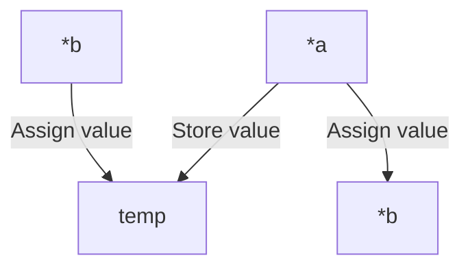

## ft_swap Function

The `ft_swap` function is responsible for swapping the contents of two integers whose addresses are passed as parameters.

### Function Signature

```c
void ft_swap(int *a, int *b);
```

### Algorithm Explanation

1. Declare a temporary variable `temp` to store the value of `*a`.
2. Assign the value of `*b` to `*a`, effectively swapping the values.
3. Assign the value of `temp` to `*b`, restoring the original value of `*a`.

### Pseudocode



The function takes two pointers as input, `*a` and `*b`. It follows these steps:
1. Stores the value of `*a` in a temporary variable called `temp`.
2. Assigns the value of `*b` to `*a`, effectively swapping the values.
3. Assigns the value stored in `temp` back to `*b`, restoring the original value of `*a`.

### Example Usage

```c
int main() {
    int x = 10;
    int y = 20;

    printf("Before swap: x = %d, y = %d\n", x, y);
    ft_swap(&x, &y);
    printf("After swap: x = %d, y = %d\n", x, y);

    return 0;
}
```

Output:

```
Before swap: x = 10, y = 20
After swap: x = 20, y = 10
```

In the example above, the `ft_swap` function is used to swap the values of `x` and `y`. The initial values are `x = 10` and `y = 20`. After calling `ft_swap(&x, &y)`, the values are swapped, resulting in `x = 20` and `y = 10`.
