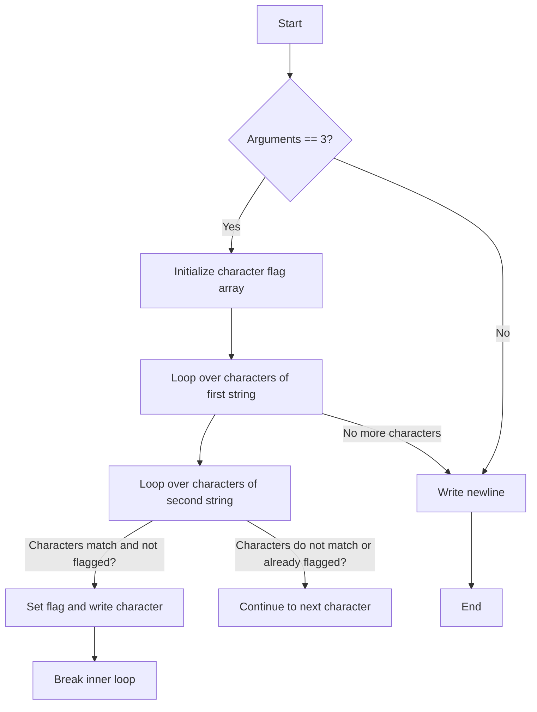

## Subject: Finding Common Characters in Two Strings

### Task Description
Write a program that takes two strings and displays, without doubles, the characters that appear in both strings, in the order they appear in the first one. The program should output the result followed by a newline character.

If the number of arguments is not 2, the program should only output a newline character.

### Examples
- Example 1:
  ```
  $ ./inter "padinton" "paqefwtdjetyiytjneytjoeyjnejeyj" | cat -e
  padinto$
  ```
- Example 2:
  ```
  $ ./inter ddf6vewg64f gtwthgdwthdwfteewhrtag6h4ffdhsd | cat -e
  df6ewg4$
  ```
- Example 3:
  ```
  $ ./inter "rien" "cette phrase ne cache rien" | cat -e
  rien$
  ```
- Example 4:
  ```
  $ ./inter | cat -e
  $
  ```

### Code Explanation

The provided code attempts to solve the task. Let's analyze it step by step:

1. The program checks if the number of arguments is 3 (two strings and the program name). If not, it immediately writes a newline character and exits.

2. The program initializes an array `c` of 250 integers, all set to 0. This array will be used as a character flag.

3. The program iterates over the characters of the first string (`argv[1]`) using the variable `i`.

4. For each character in the first string, the program iterates over the characters of the second string (`argv[2]`) using the variable `j`.

5. If the current characters from both strings match (`argv[1][i] == argv[2][j]`) and the character has not been flagged yet (`!c[(int)argv[2][j]]`), the program performs the following steps:
   - Sets the flag for the character by assigning `1` to `c[(int)argv[2][j]]`.
   - Writes the current character from the first string to the standard output using the `write` function.
   - Breaks out of the inner loop (`j` loop) and continues to the next character of the first string.

6. Finally, the program writes a newline character to the standard output.

### Flowchart



