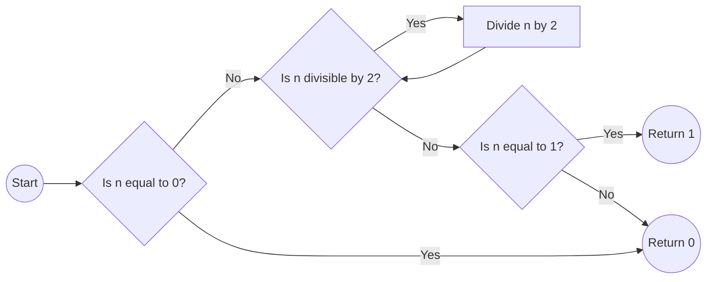

# Separador


## is_power_of_2

The `is_power_of_2` function determines if a given number is a power of 2. It returns 1 if the number is a power of 2, and 0 otherwise.

```c
int is_power_of_2(unsigned int n)
{
    if (n == 0)
        return 0;
    
    while (n % 2 == 0)
        n /= 2;
    
    if (n == 1)
        return 1;
    
    return 0;
}
```

The function follows the following steps to determine if a number is a power of 2:

1. If the input number `n` is 0, it immediately returns 0 since 0 is not a power of 2.
2. The function enters a loop while `n` is divisible by 2 (i.e., `n % 2 == 0`). Inside the loop, it divides `n` by 2 repeatedly until `n` is no longer divisible by 2.
3. After the loop, if `n` is equal to 1, it means that the original input number was a power of 2, so it returns 1.
4. If `n` is not equal to 1 after the loop, it means the original input number was not a power of 2, so it returns 0.

### Flowchart



The code first checks if the input number `n` is 0. If it is, the code immediately returns 0 since 0 is not a power of 2. Otherwise, it enters a loop to divide `n` by 2 until it is no longer divisible by 2. After the loop, it checks if `n` is equal to 1. If it is, it means the original input number was a power of 2, and the code returns 1. If `n` is not equal to 1 after the loop, it means the original input number was not a power of 2, and the code returns 0.

Note: The provided code correctly determines whether a given number is a power of 2.

