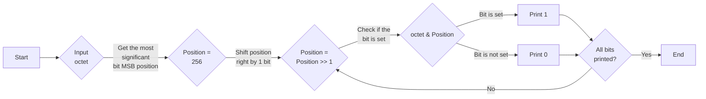

**Subject:** `print_bits`

**Explanation:**
The code defines a function named `print_bits` that takes an unsigned char `octet` as input and prints its binary representation without a newline at the end. The function uses the `write` function from the `<unistd.h>` library to output characters.

The function starts by initializing a variable `i` with a value of 256, representing the most significant bit (MSB) position. It then enters a loop where `i` is right-shifted by 1 bit in each iteration until it becomes 0.

Inside the loop, the function checks if the bit at the current position (represented by `octet & i`) is set. If the bit is set, it writes the character '1' using the `write` function. Otherwise, it writes the character '0'.

After printing a bit, the function checks if all bits have been printed. If yes, it ends. If not, it continues to the next iteration of the loop to print the next bit.

Please note that the diagram represents the control flow of the code, and the `write` function is used to output characters but is not explicitly shown in the diagram.
