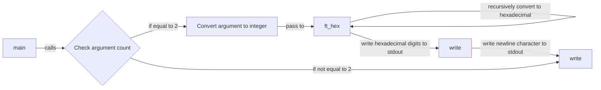

## Assignment: print_hex

### Subject
Write a program that takes a positive (or zero) number expressed in base 10 and displays it in base 16 (lowercase letters) followed by a newline. If the number of parameters is not 1, the program displays a newline.

### Solution Explanation

The provided solution consists of a C program that converts a positive (or zero) number from base 10 to base 16 and prints it followed by a newline.

The program uses the following functions:

1. `ft_hex(int nbr)`: This recursive function converts a given decimal number `nbr` to its hexadecimal representation. It performs the conversion by repeatedly dividing the number by 16 and printing the corresponding hexadecimal digit. The hexadecimal digits are represented by the characters "0123456789abcdef" (from 0 to 15). The function uses the `write` system call to output each hexadecimal digit.

2. `ft_atoui(char *str)`: This function converts a string `str` to an integer by iterating over each character, multiplying the existing number by 10, and adding the numeric value of the current character minus '0'. It returns the resulting integer.

3. `main(int ac, char **av)`: The `main` function is the entry point of the program. It checks the number of command-line arguments (`ac`) and if it is equal to 2, it converts the second argument (`av[1]`) to an integer using `ft_atoui` and passes it to `ft_hex` for conversion and printing. Finally, it writes a newline character to stdout using the `write` system call.

If the number of command-line arguments is not equal to 2, the program directly writes a newline character to stdout.

### Code Diagram



### Code

```c
#include <unistd.h>

void ft_hex(int nbr)
{
    char *str = "0123456789abcdef";
    if (nbr > 16)
        ft_hex(nbr / 16);
    write(1, &str[nbr % 16], 1);
}

int ft_atoui(char *str)
{
    int nbr = 0;
    while (*str)
        nbr = nbr * 10 + *str++ - '0';
    return nbr;
}

int main(int ac, char **av)
{
    int nbr = 0;

    if (ac == 2)
    {
        nbr = ft_atoui(av[1]);
        ft_hex(nbr);
    }
    write(1, "\n", 1);
    return 0;
}
```

The program checks the number of command-line arguments, and if it is equal to 2, it converts the second argument to an integer using the `ft_atoui` function. Then, it passes the integer to the `ft_hex` function for conversion to hexadecimal representation. Finally, it writes a newline character to stdout. If the number of arguments is not 2, it only writes a newline character to stdout.

The program follows a recursive approach to convert the number from decimal to hexadecimal, dividing the number by 16 and printing the remainder until the quotient becomes less than 16. The remainder is used as an index to access the corresponding hexadecimal digit from the string "0123456789abcdef", and the `

write` function is used to output each digit.

After the conversion and printing are complete, a newline character is written to stdout to fulfill the assignment's requirements.
