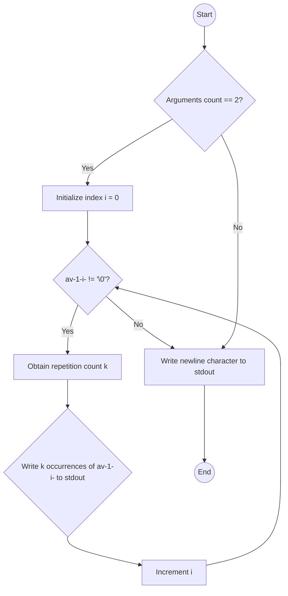

## Assignment: repeat_alpha

### Subject

Write a program called `repeat_alpha` that takes a string and displays it, repeating each alphabetical character as many times as its alphabetical index, followed by a newline. The case of the characters should remain unchanged. If the number of arguments is not 1, just display a newline.

Examples:

```
$> ./repeat_alpha "abc"
abbccc
$> ./repeat_alpha "Alex." | cat -e
Alllllllllllleeeeexxxxxxxxxxxxxxxxxxxxxxxx.$
$> ./repeat_alpha 'abacadaba 42!' | cat -e
abbacccaddddabba 42!$
$> ./repeat_alpha | cat -e
$
$> ./repeat_alpha "" | cat -e
$
```

### Solution

The provided code solves the given problem. Here is an explanation of the code:

1. The `repeat` function takes a character `c` as input and returns the number of times the character should be repeated based on its alphabetical index.
   - If the character is lowercase (between 'a' and 'z'), it returns the index as `c - 'a' + 1`.
   - If the character is uppercase (between 'A' and 'Z'), it returns the index as `c - 'A' + 1`.
   - For non-alphabetical characters, it returns 1.

2. The `main` function checks if the number of arguments (`ac`) is 2. If not, it simply writes a newline character and exits.
3. If the number of arguments is 2, the program proceeds to iterate over each character in the input string (`av[1]`).
   - For each character, it obtains the repetition count (`k`) by calling the `repeat` function.
   - It then writes the character `k` times to the standard output using the `write` function.
4. Finally, the program writes a newline character and exits.

### Flowchart

Here's a flowchart representation of the program's logic:



The flowchart shows that the program checks the argument count first. If it's 2, the program iterates over the input string, obtaining the repetition count for each character and writing the character to stdout accordingly. If the argument count is not 2, it directly writes a newline character to stdout and exits.

The provided code correctly implements this flowchart logic to solve the given problem.
