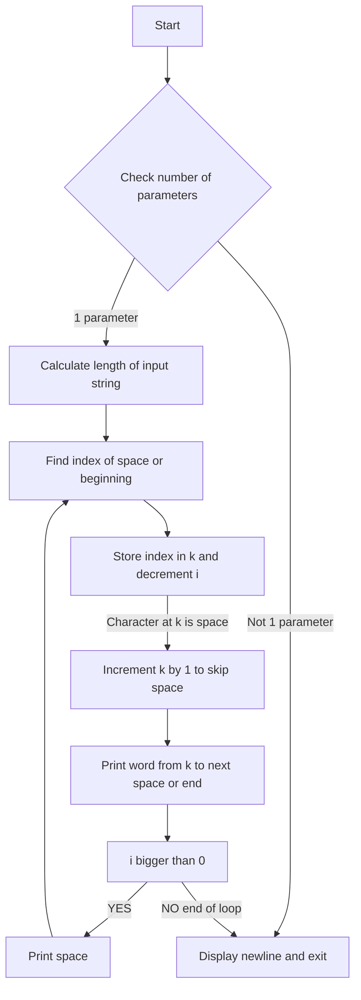

# Subject: Reverse Word Order

## Problem Statement

Write a program that takes a string as a parameter and prints its words in reverse order.

## Examples

Example 1:
Input: "You hate people! But I love gatherings. Isn't it ironic?"
Output: "ironic? it Isn't gatherings. love I But people! hate You"

Example 2:
Input: "abcdefghijklm"
Output: "abcdefghijklm"

Example 3:
Input: "Wingardium Leviosa"
Output: "Leviosa Wingardium"

Example 4:
Input: (No input provided)
Output: ""


```c
#include <unistd.h>

int main(int ac, char **av)
{
    int i = 0, k = 0;

    if (ac == 2)
    {
        while (av[1][i])
            i++;
        
        while (i > 0)
        {
            while (av[1][i] != ' ' && i)
                i--;
            
            k = i--;
            
            if (av[1][k] == ' ')
                k++;
            
            while (av[1][k] && av[1][k] != ' ')
                write(1, &av[1][k++], 1);
            
            if (i > 0)
                write(1, " ", 1);
        }
    }
    
    write(1, "\n", 1);
    return 0;
}
```

## Explanation of the Code

1. First, you include the necessary header file `unistd.h` which provides the `write` function.

2. In the `main` function, you declare two variables `i` and `k` and initialize them to 0.

3. Next, you check if the number of command-line arguments (`ac`) is equal to 2, indicating that a single parameter (the input string) was provided.

4. Inside the `if` block, you enter a loop to calculate the length of the input string by iterating over its characters. You increment `i` until you reach the null terminator.

5. After calculating the length, you enter another loop to reverse and print the words in the input string. This loop starts from the end of the string and iterates backward.

6. Within this loop, you first find the index of the space character or the beginning of the string. You decrement `i` to move backward in the string until you find a space or reach the beginning.

7. Once you have found the index `i` for the start of a word, you store it in `k` and decrement `i` again.

8. If the character at index `k` is a space, you increment `k` by one to skip the space before the word.

9. You then enter another loop to print the word starting from index `k` up to the next space character or the end of the string. You increment `k` as you print each character.

10. After printing the word, you check if `i` is greater than 0. If so, you print a space character to separate the words.

11. Finally, after the loops, you write a newline character to complete the output.




