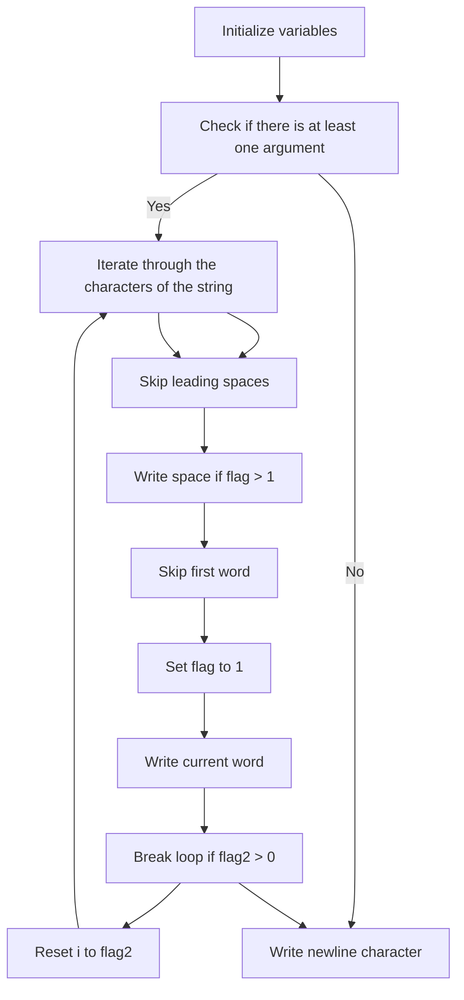

## rostring

### Problem Statement

Write a program that takes a string and displays this string after rotating it one word to the left. The first word becomes the last, and the other words remain in the same order. Words are delimited by spaces or tabs.

### Implementation

The implementation uses the following steps:

1. Initialize variables:
   - `i`: Counter variable for iterating through the string.
   - `flag`: Flag to track whether a word has been encountered.
   - `flag2`: Flag to track the position of the first word.

2. Check if there is at least one command-line argument provided (`ac > 1`).

3. Iterate through the characters of the input string (`av[1]`):
   - Skip over any leading spaces (`while(av[1][i] == ' ')`).
   - If a non-space character is encountered and `flag` is greater than 1, write a space character to separate words.
   - Skip over the current word (`while(av[1][i] && av[1][i] != ' ' && !flag)`).
   - Set `flag` to 1 to indicate that a word has been encountered.
   - Write the characters of the current word until a space is encountered (`while(av[1][i] && av[1][i] != ' ')`).
   - If `flag2` is non-zero (indicating that the first word has been processed), break the loop.
   - If the end of the string is reached, reset `i` to `flag2` to start processing the first word again.

4. After the loop, write a newline character to end the output.

### Flowchart

### Example Runs

Input: `"abc   "`

Output: `abc`

Input: `"Que la      lumiere soit et la lumiere fut"`

Output: `la lumiere soit et la lumiere fut Que`

Input: `"     AkjhZ zLKIJz , 23y"`

Output: `zLKIJz , 23y AkjhZ`

Input: (No arguments)

Output: (Empty line)
