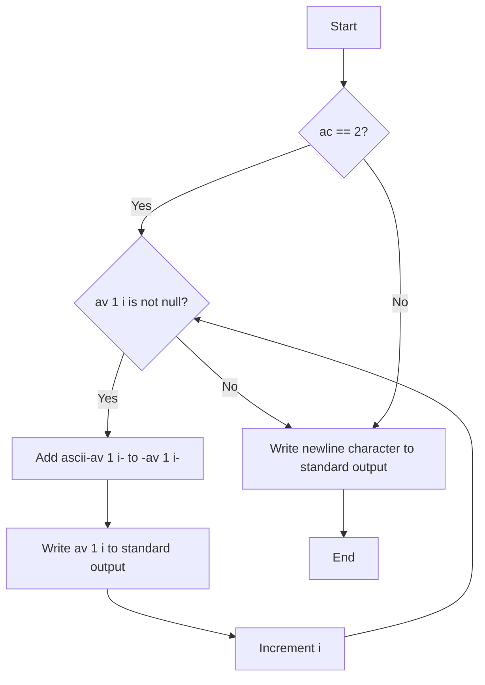

## Assignment Name: rotone

### Problem Description
Write a program that takes a string and displays it, replacing each of its letters by the next one in alphabetical order. 'z' becomes 'a' and 'Z' becomes 'A'. The case remains unaffected. If the number of arguments is not 1, the program displays a newline.

### Code Explanation
The given code implements the required functionality. Here's a breakdown of the code:

```c
#include <unistd.h>

int ascii(char c)
{
    if ((c >= 'a' && c <= 'y') || (c >= 'A' && c <= 'Y'))
        return 1;
    if ((c == 'z') || (c == 'Z'))
        return -25;
    return 0;
}

int main(int ac, char **av)
{
    int i = 0;

    if (ac == 2)
    {
        while (av[1][i])
        {
            av[1][i] += ascii(av[1][i]);
            write(1, &av[1][i], 1);
            i++;
        }
    }
    write(1, "\n", 1);
    return 0;
}
```

The `ascii` function checks whether the given character `c` is within the range 'a' to 'y' (lowercase) or 'A' to 'Y' (uppercase). If true, it returns 1. If `c` is 'z' or 'Z', it returns -25. Otherwise, it returns 0.

The `main` function checks if the number of arguments (`ac`) is equal to 2. If true, it proceeds with the following steps:
1. It iterates over each character in the string `av[1]`.
2. For each character, it adds the result of `ascii(av[1][i])` to the character itself, effectively replacing it with the next character in alphabetical order.
3. It writes the modified character to the standard output using the `write` function.
4. It increments the index `i` to move to the next character.
5. After the loop, it writes a newline character (`\n`) to the standard output.

If the number of arguments is not 2, the program only writes a newline character to the standard output.

### Flowchart



This diagram represents the control flow of the program. It starts by checking if `ac` is equal to 2. If true, it proceeds with the loop to modify and write the characters. If false, it directly writes a newline character and terminates.

Overall, the code takes a string as input and replaces each letter with the next one in alphabetical order, considering the case.


