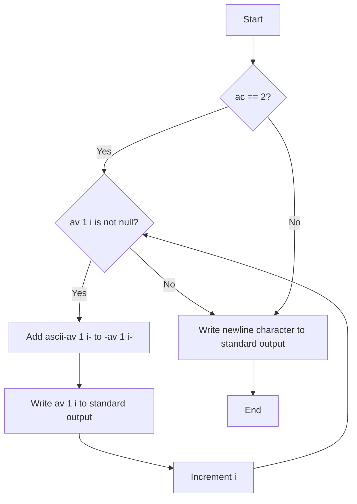

## Subject: rotone

### Problem Description
The goal of this assignment is to write a program that takes a string as input and displays the string with each letter replaced by the next one in alphabetical order. The replacement should follow these rules:

- 'z' should be replaced with 'a'
- 'Z' should be replaced with 'A'
- The case of the letters should remain unaffected

If the number of arguments provided is not exactly 1, the program should display a newline character.

### Example

Input:
```
$> ./rotone "abc"
```
Output:
```
bcd
```

Input:
```
$> ./rotone "Les stagiaires du staff ne sentent pas toujours tres bon." | cat -e
```
Output:
```
Mft tubhjbjsft ev tubgg of tfoufou qbt upvkpvst usft cpo.$
```

Input:
```
$> ./rotone "AkjhZ zLKIJz , 23y " | cat -e
```
Output:
```
BlkiA aMLJKa , 23z $
```

Input:
```
$> ./rotone | cat -e
```
Output:
```
$
```

Input:
```
$> ./rotone "" | cat -e
```
Output:
```
$
```

### Implementation

The code provided for the `rotone` program is as follows:

```c
#include <unistd.h>

int ascii(char c)
{
    if ((c >= 'a' && c <= 'y') || (c >= 'A' && c <= 'Y'))
        return 1;
    if (c == 'z' || c == 'Z')
        return -25;
    return 0;
}

int main(int ac, char **av)
{
    int i = 0;
    if (ac == 2)
    {
        while (av[1][i])
            i += write(1, &(char){(char)(av[1][i] += ascii(av[1][i]))}, 1);
    }
    write(1, "\n", 1);
    return 0;
}
```
I am firmly convinced that my first version is much more readable! :joy:

The program starts by defining a helper function `ascii` that determines the offset to add to a character in order to rotate it to the next character in alphabetical order. The function returns `1` if the character is in the range 'a'-'y' or 'A'-'Y', returns `-25` if the character is 'z' or 'Z', and returns `0` otherwise.

In the `main` function, the program checks if the number of arguments (`ac`) is equal to 2, indicating that a string was provided as an argument. If there is exactly one argument, the program proceeds to iterate over each character of the input string and writes the rotated character to the standard output using the `write` function. The rotation is achieved by adding the offset returned by the `ascii` function to the current character.

After processing the input string, the program writes a newline character to the standard output.

If the number of arguments is not 2, the program simply writes a newline character to the standard output.

### Explanation

The provided program follows a simple logic to implement the desired functionality. It relies on the `write` function to output characters and uses the `ascii` helper function to determine the rotation offset for each character.

The main loop iterates over each character of the input string (`av[1]`) and updates the character by adding the rotation offset. The updated character is then passed as a reference to the `write` function, which writes it to the standard output. The loop

 continues until the null-terminating character (`'\0'`) is reached, indicating the end of the string.

Finally, the program writes a newline character to the standard output using the `write` function.

### Flowchart

Here is a flowchart illustrating the flow of the program:



This flowchart provides a visual representation of the program's control flow and highlights the main steps involved in processing the input string and producing the output.

Overall, the program is a simple implementation that fulfills the requirements of the assignment by rotating the characters in the input string and outputting the result.
