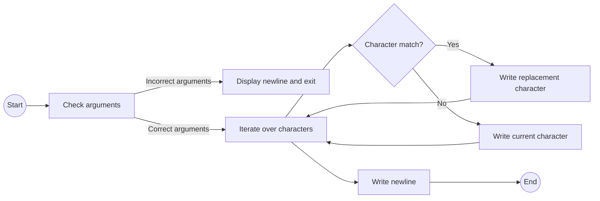

## Assignment: search_and_replace

### Subject

Write a program called `search_and_replace` that takes 3 arguments: a string in which to replace a letter (2nd argument) by another one (3rd argument).

If the number of arguments is not 3, the program should simply display a newline.

If the second argument is not contained in the first string, then the program should rewrite the string followed by a newline.

### Code Explanation

```c
#include <unistd.h>

int main(int ac, char **av)
{
    int i = 0;

    if(ac == 4 && !av[2][1] && !av[3][1])
    {
        while (av[1][i])
        {
            if(av[1][i] == av[2][0])
                write(1, &av[3][0], 1);
            else
                write(1, &av[1][i], 1);
            i++;
        }
    }
    write(1, "\n", 1);
    return (0);
}
```

The code starts by including the necessary header file `unistd.h`, which provides the `write` function.

In the `main` function, an integer variable `i` is declared and initialized to 0.

The program checks if the number of command-line arguments (`ac`) is equal to 4 and if the second and third arguments have a length of 1 (i.e., they are single characters). If these conditions are met, the program proceeds with the string replacement logic.

Inside the `while` loop, the program iterates over each character of the first argument (`av[1]`). For each character, it checks if it matches the first character of the second argument (`av[2][0]`). If there is a match, it writes the first character of the third argument (`av[3][0]`) to the standard output using the `write` function. Otherwise, it writes the current character from the first argument.

After processing all characters, the program writes a newline character (`\n`) to the standard output using the `write` function.

### Flowchart



The flowchart represents the logical flow of the program.

1. The program starts at the **Start** node.
2. It checks if the arguments are correct (number of arguments = 4, and second and third arguments have length 1) at the **Check arguments** node.
3. If the arguments are incorrect, it proceeds to the **Display newline and exit** node, where a newline is displayed, and the program ends.
4. If the arguments are correct, it iterates over each character of the first argument at the **Iterate over characters** node.
5. For each character, it checks if there is a match with the first character of the second argument at the **Character match?** node.
6. If there is a match, it proceeds to the **Write replacement character** node, where the replacement character is written to the standard output.
7. If there is no match, it proceeds to the **Write current character** node, where the current character is written to the standard output.
8. After processing all characters, it proceeds to the **Write newline** node, where a newline character
