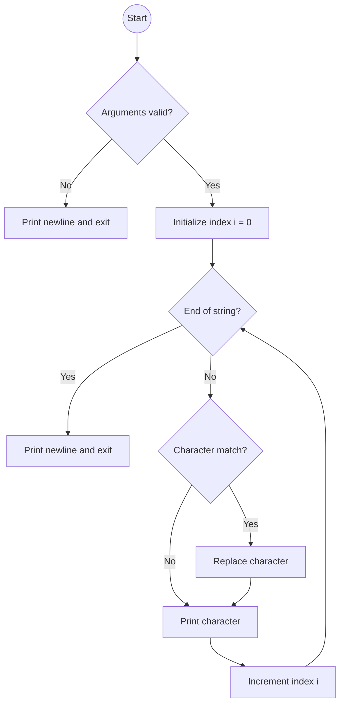

### Assignment: search_and_replace

#### Subject
The task is to write a program called `search_and_replace` that takes three arguments:
1. A string in which to replace a letter.
2. The letter to be replaced.
3. The letter to replace with.

The program should perform the following actions:
- If the number of arguments is not 3, it should display a newline and exit.
- If the second argument is not contained in the first argument, the program should simply rewrite the string followed by a newline.
- If the second argument is found in the first argument, it should replace all occurrences of the second argument with the third argument and print the modified string followed by a newline.

#### Code Explanation

The given code is written in C and uses the standard library function `write` and the function `exit`. Here is an explanation of the code:

```c
#include <unistd.h>

int main(int ac, char **av)
{
    int i = 0;
    if (ac == 4 && !av[2][1] && !av[3][1])
    {
        while(av[1][i])
        {
            if(av[1][i] == av[2][0])
                av[1][i] = av[3][0];
            i += write(1, &av[1][i], 1);
        }
    }
    write(1, "\n", 1);
    return (0);
}
```

1. The program starts by checking if the number of arguments (`ac`) is equal to 4 and if the length of the second and third arguments (`av[2]` and `av[3]`) is 1. If this condition is not met, the program writes a newline and exits.
2. If the condition is met, the program enters a loop that iterates over each character of the first argument (`av[1]`).
3. Inside the loop, it checks if the current character is equal to the second argument's first character (`av[2][0]`).
4. If the characters are equal, it replaces the current character with the third argument's first character (`av[3][0]`).
5. After the replacement, it writes the modified character to the standard output using the `write` function.
6. The loop continues until the end of the first argument is reached.
7. Finally, the program writes a newline character to the standard output and returns 0 to indicate successful execution.

The code uses the `write` function to output characters one by one, allowing for immediate display without the need for buffering. The program takes advantage of the fact that C strings are null-terminated, so it can iterate over the characters until it encounters the null terminator (`'\0'`) to determine the end of the string.

#### Flowchart

Here is a flowchart representation of the program logic:



The flowchart illustrates the program's flow, starting from the beginning and progressing through the different conditions and actions until it reaches the end.
