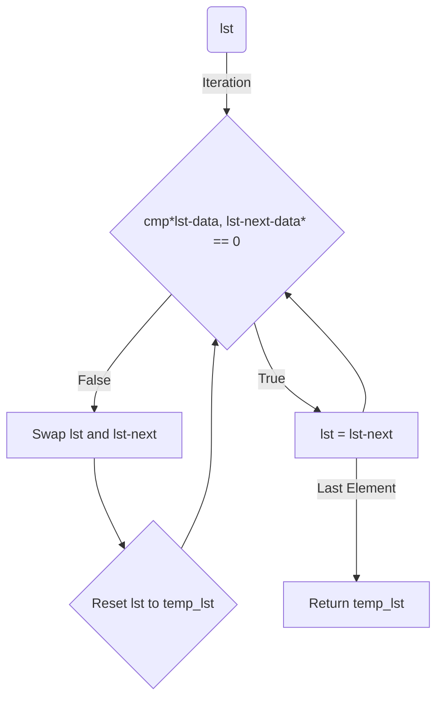

# Sort List

## Subject
Implement a function `sort_list` that sorts a linked list in ascending order based on a given comparison function.

```c
t_list *sort_list(t_list* lst, int (*cmp)(int, int));
```

The function `sort_list` takes two parameters:
- `lst`: A pointer to the first element of the linked list to be sorted.
- `cmp`: A function pointer that compares two integer values and returns a non-zero value if they are in the correct order.

The function should sort the list in ascending order according to the comparison function `cmp` and return a pointer to the first element of the sorted list.

## Code Explanation
The provided code implements the `sort_list` function as follows:

1. Create a temporary pointer `temp_lst` and set it to the input `lst`.
2. Create a temporary variable `temp_data` to store integer values during swapping.
3. Check if the list contains only one element (`lst->next` is `NULL`). If true, return the list as it is already sorted.
4. Iterate over the list while `lst->next` is not `NULL`.
   - If the comparison function `cmp` returns `0` for the current element and the next element (`lst->data` and `lst->next->data`), it means they are not in the correct order.
     - Swap the values of the current element and the next element by using the temporary variable `temp_data`.
     - Reset the `lst` pointer to the beginning of the list (`temp_lst`).
   - If the elements are in the correct order, move to the next element (`lst = lst->next`).
5. Return the pointer to the first element of the sorted list (`temp_lst`).

The provided code essentially performs a bubble sort on the linked list. It compares adjacent elements and swaps them if they are not in the correct order. The process repeats until the entire list is sorted.

## Diagram



The diagram illustrates the execution flow of the provided code. It shows the iterative process of comparing and swapping adjacent elements in the linked list until the entire list is sorted.
