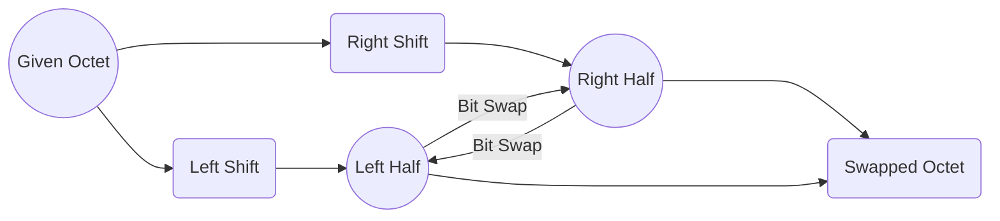

## **Subject: Swapping Halves of a Byte**

The task is to write a C function `swap_bits` that takes a byte, swaps its halves, and returns the result.

### Function Signature:
```c
unsigned char swap_bits(unsigned char octet);
```

### Approach:
The given byte consists of 8 bits, which can be divided into two equal halves, each containing 4 bits. The goal is to swap the positions of the bits in the two halves. 

To achieve this, the following steps are performed in the `swap_bits` function:
1. Left-shift the given `octet` by 4 bits and store the result in the variable `nibble`. This moves the bits in the left half to the right half, shifting them by 4 positions.
2. Right-shift the given `octet` by 4 bits to move the bits in the right half to the left half.
3. Use the bitwise OR (`|`) operator to combine the right-shifted `octet` with the `nibble` obtained from the left shift. This swaps the positions of the bits in the two halves.
4. Return the swapped `octet`.

### Code:
Here is the implementation of the `swap_bits` function in C:

```c
unsigned char swap_bits(unsigned char octet)
{
    unsigned char nibble = octet << 4;
    octet = (octet >> 4) | nibble;
    return octet;
}
```

The `swap_bits` function takes an unsigned char `octet` as input, performs the swapping of the bits in its halves using the described approach, and returns the swapped `octet`.

### Diagram:
The diagram below illustrates the bit swapping process using mermaid:



The given octet is first left-shifted, moving the left half of the bits to the right half. Then, the right half of the bits is right-shifted, moving them to the left half. Finally, the bits in the two halves are swapped using bitwise OR operation, resulting in the swapped octet.
## **Bitwise Operators in C**

Bitwise operators in C are used to perform operations on individual bits of integers or other data types. These operators allow manipulation of bits at a binary level.

The commonly used bitwise operators in C are:

- **Bitwise AND (`&`):** Performs a bitwise AND operation between two operands. It returns a value where each bit is set if and only if the corresponding bits of both operands are set.

- **Bitwise OR (`|`):** Performs a bitwise OR operation between two operands. It returns a value where each bit is set if any of the corresponding bits of either operand is set.

- **Bitwise XOR (`^`):** Performs a bitwise XOR (exclusive OR) operation between two operands. It returns a value where each bit is set if and only if the corresponding bits of the operands differ.

- **Bitwise NOT (`~`):** Performs a bitwise complement operation on a single operand. It returns the one's complement of the operand, flipping each bit.

- **Left Shift (`<<`):** Shifts the bits of the left operand to the left by the number of positions specified by the right operand. This operation effectively multiplies the left operand by 2 raised to the power of the right operand.

- **Right Shift (`>>`):** Shifts the bits of the left operand to the right by the number of positions specified by the right operand. This operation effectively divides the left operand by 2 raised to the power of the right operand.

These operators provide powerful capabilities for working with individual bits and are commonly used in various applications such as low-level programming, embedded systems, and bitwise manipulation tasks.


