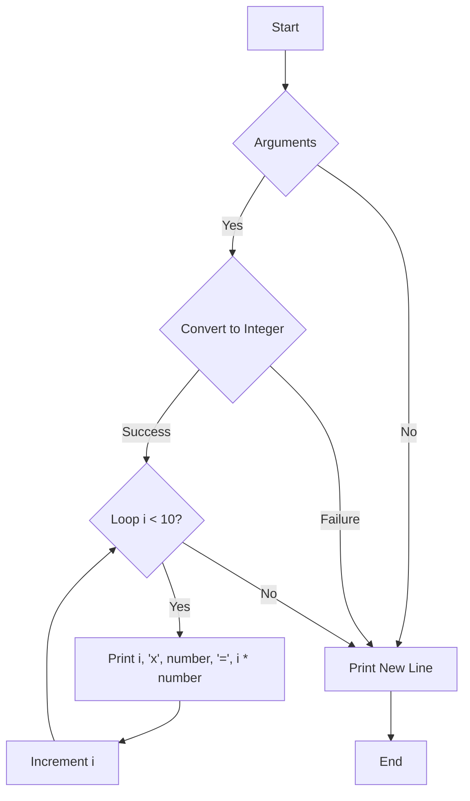

## Assignment: tab_mult

### Description
Write a program that displays a number's multiplication table.

The parameter will always be a strictly positive number that fits in an `int`, and the result of multiplying that number by 9 will also fit in an `int`.

If there are no parameters, the program should display a new line.

### Example

```
$> ./tab_mult 9
1 x 9 = 9
2 x 9 = 18
3 x 9 = 27
4 x 9 = 36
5 x 9 = 45
6 x 9 = 54
7 x 9 = 63
8 x 9 = 72
9 x 9 = 81
$> ./tab_mult 19
1 x 19 = 19
2 x 19 = 38
3 x 19 = 57
4 x 19 = 76
5 x 19 = 95
6 x 19 = 114
7 x 19 = 133
8 x 19 = 152
9 x 19 = 171
$> ./tab_mult | cat -e
$
```

### Solution

Below is the solution code for the `tab_mult` program:

```c
#include <unistd.h>

// Function to print an integer to standard output
void ft_putnbr(int nbr)
{
    if (nbr > 9)
        ft_putnbr(nbr / 10);
    write(1, &(char){(char)(nbr % 10 + '0')}, 1);
}

// Function to convert a string to an integer
int ft_itoa(char *str)
{
    int nbr = 0;
    while (*str)
        nbr = nbr * 10 + *str++ - '0';
    return nbr;
}

int main(int ac, char **av)
{
    int nbr, i = 1;
    if (ac == 2)
    {
        nbr = ft_itoa(av[1]);
        while (i < 10)
        {
            ft_putnbr(i);
            write(1, " x ", 3);
            ft_putnbr(nbr);
            write(1, " = ", 3);
            ft_putnbr(i * nbr);
            write(1, "\n", 1);
            i++;
        }
    }
    else
        write(1, "\n", 1);
    return 0;
}
```

The program starts by including the necessary header files, `unistd.h`, which provides the write function for output. The program defines two functions: `ft_putnbr` and `ft_itoa`.

The `ft_putnbr` function is a recursive function that prints an integer to the standard output. It recursively divides the number by 10 to obtain each digit and then converts it to a character by adding the ASCII value of '0'. The resulting character is written to the standard output using the `write` function.

The `ft_itoa` function converts a string to an integer. It iterates through each character of the string, converting it to an integer by subtracting the ASCII value of '0' and multiplying by 10 to shift the existing value and add the new digit.

In the `main` function, the program first declares the variables `nbr` and `i` and initializes `i` to 1. Then it checks if the program was executed with exactly two arguments (`ac == 2`). If so, it converts the second argument (`av[1]`) to an integer using the `ft_itoa` function and assigns the result to `nbr`.

Next, it enters a loop that repeats until `i is less than 10`. Inside the loop, it calls the `ft_putnbr` function to print the current value of `i`. It then writes the strings " x ", " = ", and a new line character to the standard output using the `write` function. Finally, it increments `i` and repeats the loop.

If the program was not executed with exactly two arguments, it writes a new line character to the standard output and exits.

Overall, the program takes a positive integer as input and prints its multiplication table up to 9 times that number.

### Flowchart

The flowchart below illustrates the flow of the program:



The program starts at the "Start" node and checks if there are arguments. If there are arguments, it proceeds to convert the second argument to an integer. If successful, it enters a loop to print the multiplication table. After printing the table, it increments `i` and checks if the loop should continue. If the loop ends, or if there are no arguments, the program prints a new line and reaches the "End" node.
