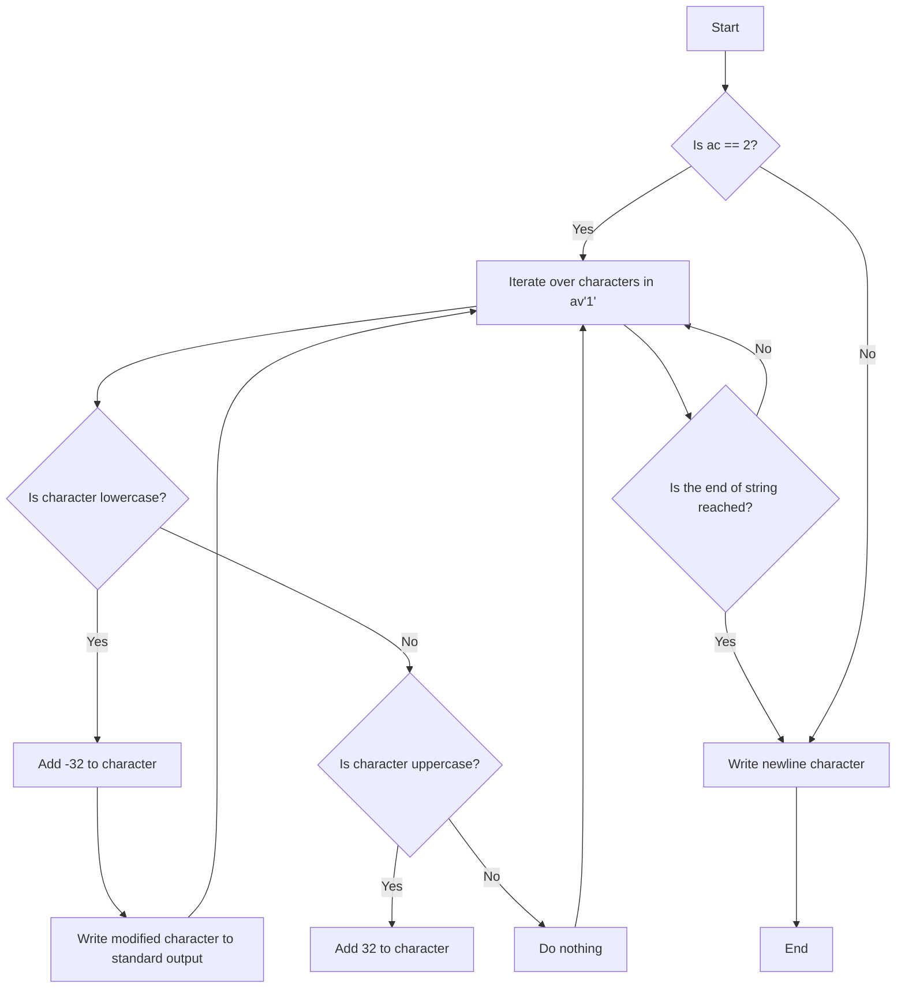

## Assignment: ulstr

### Subject
Write a program that takes a string and reverses the case of all its letters. Other characters remain unchanged.

### Approach and Explanation

The program follows the following steps:

1. Include the necessary header file `unistd.h` for the `write` function.
2. Define a function `ascii` that takes a character `c` as input and returns an offset value depending on whether the character is lowercase or uppercase. If `c` is lowercase, it returns `-32`, and if `c` is uppercase, it returns `32`. Otherwise, it returns `0`.
3. In the `main` function, check if the number of arguments (`ac`) is equal to 2. If not, simply write a newline character and exit.
4. If there is exactly one argument (`ac == 2`), iterate over each character in `av[1]` (the input string).
5. Inside the loop, add the offset value returned by the `ascii` function to each character `av[1][i]` to reverse its case. This is done by directly modifying the character in place.
6. Write the modified character to the standard output using the `write` function. The number of bytes written (`1`) is stored in `i` to keep track of the position in the string.
7. Finally, write a newline character to the standard output to separate the output from the command prompt.

The program uses the ASCII character encoding scheme to convert lowercase letters to uppercase and vice versa. The conversion is done by adding or subtracting a fixed offset from the ASCII value of each character.

Here is a flowchart representation of the program's logic:



### Code

```c
#include <unistd.h>

int ascii(char c)
{
    if (c >= 'a' && c <= 'z')
        return -32;
    if (c >= 'A' && c <= 'Z')
        return 32;
    return 0;
}

int main(int ac, char **av)
{
    if (ac != 2)
    {
        write(1, "\n", 1);
        return 0;
    }

    int i = 0;
    while (av[1][i])
    {
        av[1][i] += ascii(av[1][i]);
        write(1, &av[1][i], 1);
        i++;
    }

    write(1, "\n", 1);
    return 0;
}
```

The program starts by including the necessary header file `unistd.h` for the `write` function.

The `ascii` function takes a character `c` as input and returns an offset value depending on whether the character is lowercase or uppercase. If `c` is lowercase, it returns `-32`. If `c` is uppercase, it returns `32`. Otherwise, it returns `0`.

In the `main` function, the number of arguments (`ac`) is checked. If it

 is not equal to 2, indicating that there is not exactly one argument (the input string), a newline character is written to the standard output, and the program exits.

If there is exactly one argument (`ac == 2`), the program iterates over each character in `av[1]` (the input string). For each character, it calls the `ascii` function to get the offset value, adds it to the character to reverse its case, and writes the modified character to the standard output using the `write` function.

Finally, a newline character is written to the standard output to separate the output from the command prompt.

The program can be compiled and executed to test its functionality.

Please let me know if you have any further questions!
